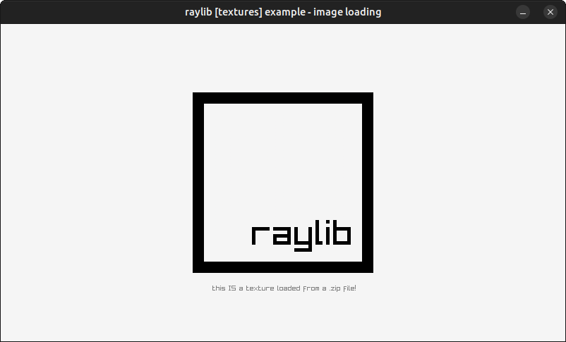

# raylib-physfs

[](https://github.com/RobLoach/raylib-physfs/actions/workflows/Tests.yml)

Load [raylib](https://www.raylib.com/) images, sounds, music, fonts and shaders from data archives, like `.zip` files, through [PhysicsFS](https://github.com/icculus/physfs).

[](examples/textures/textures_image_loading.c)

## Features

- Load various assets from data archives, including Images, Textures, Music, Waves, Fonts, Text, Data and Shaders
- Check if directories and files exist within archives
- Enumerate across multiple archives and mounted paths
- Save files through PhysFS
- Set all file loading to use PhysFS via `SetPhysFSCallbacks()`
- Find the user's configuration directory with `GetPerfDirectory()`

## Usage

This is a header-only library. To use it, you have to do two things...

1. Link both the raylib and physfs libraries. With CMake, you will see examples of linking physfs in [examples/CMakeLists.txt](examples/CMakeLists.txt)
2. Define `RAYLIB_PHYSFS_IMPLEMENTATION` in one `.c` source file before including [`raylib-physfs.h`](include/raylib-physfs.h)

### Example

The below example will initialize PhysFS, mount a .zip file, and then load an Image directly from the .zip.

``` c
#define RAYLIB_PHYSFS_IMPLEMENTATION
#include "raylib-physfs.h"

int main() {
    // Initiatize the file system.
    InitPhysFS();

    // Mount a directory or archive into a given namespace.
    MountPhysFS("assets.zip", "assets");

    // Load an image through PhysFS directly from assets.zip.
    Image dog = LoadImageFromPhysFS("assets/dog.png");

    // Close the file system.
    ClosePhysFS();
}
```

### API

``` c
bool InitPhysFS();                                              // Initialize the PhysFS file system
bool InitPhysFSEx(const char* newDir, const char* mountPoint);  // Initialize the PhysFS file system with the given mount point.
bool ClosePhysFS();                                             // Close the PhysFS file system
bool IsPhysFSReady();                                           // Check if PhysFS has been initialized successfully
bool MountPhysFS(const char* newDir, const char* mountPoint);   // Mount the given directory or archive as a mount point
bool MountPhysFSFromMemory(const unsigned char *fileData, int dataSize, const char* newDir, const char* mountPoint);  // Mount the given file data as a mount point
bool UnmountPhysFS(const char* oldDir);                         // Unmounts the given directory
bool FileExistsInPhysFS(const char* fileName);                  // Check if the given file exists in PhysFS
bool DirectoryExistsInPhysFS(const char* dirPath);              // Check if the given directory exists in PhysFS
unsigned char* LoadFileDataFromPhysFS(const char* fileName, unsigned int* bytesRead);  // Load a data buffer from PhysFS (memory should be freed)
char* LoadFileTextFromPhysFS(const char* fileName);             // Load text from a file (memory should be freed)
bool SetPhysFSWriteDirectory(const char* newDir);               // Set the base directory where PhysFS should write files to (defaults to the current working directory)
bool SaveFileDataToPhysFS(const char* fileName, void* data, unsigned int bytesToWrite);  // Save the given file data in PhysFS
bool SaveFileTextToPhysFS(const char* fileName, char* text);    // Save the given file text in PhysFS
FilePathList LoadDirectoryFilesFromPhysFS(const char* dirPath);  // Get filenames in a directory path (memory should be freed)
long GetFileModTimeFromPhysFS(const char* fileName);            // Get file modification time (last write time) from PhysFS
Image LoadImageFromPhysFS(const char* fileName);                // Load an image from PhysFS
Texture2D LoadTextureFromPhysFS(const char* fileName);          // Load a texture from PhysFS
Wave LoadWaveFromPhysFS(const char* fileName);                  // Load wave data from PhysFS
Music LoadMusicStreamFromPhysFS(const char* fileName);          // Load music data from PhysFS
Font LoadFontFromPhysFS(const char* fileName, int fontSize, int *fontChars, int charsCount);  // Load a font from PhysFS
Shader LoadShaderFromPhysFS(const char *vsFileName, const char *fsFileName);  // Load shader from PhysFS
void SetPhysFSCallbacks();                                      // Set the raylib file loader/saver callbacks to use PhysFS
const char* GetPerfDirectory(const char *org, const char *app); // Get the user's current config directory for the application.
```

### Defines

Have a look at [Cmake config](CMakeLists.txt) to see how to define different things that change the behavior of physfs, raylib, and raylib-physfs.

## Development

To build the examples locally, and run tests, use [cmake](https://cmake.org/).

``` bash
git clone https://github.com/RobLoach/raylib-physfs.git
cd raylib-physfs
mkdir build
cd build
cmake ..
make
make test
cd examples
./textures_image_loading
```

## Alternatives

While physfs is great, there are alternative file systems available...
- [raylib-assetsys](https://github.com/RobLoach/raylib-assetsys)

## License

*raylib-physfs* is licensed under an unmodified zlib/libpng license, which is an OSI-certified, BSD-like license that allows static linking with closed source software. Check [LICENSE](LICENSE) for further details.
